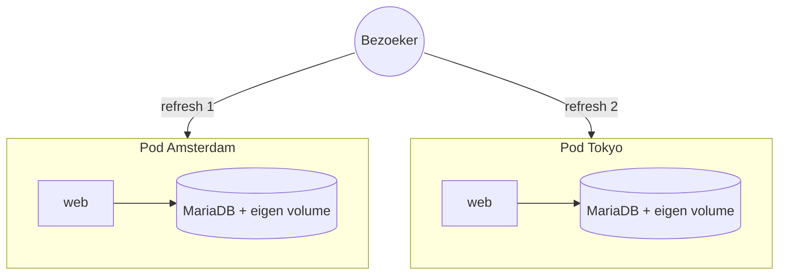

# Mooindagcounter

Mooindag! FastAPI-teller met MariaDB als backend, draait op Bunny.net Magic Containers.

## Architectuur: stateless web, precies 1 database

### Het probleem met een database-sidecar per pod

De oorspronkelijke deployment draaide `mooindagcounter-web` en `mooindagcounter-db`
samen in dezelfde Magic Containers app. Bunny start dan **per regio een pod met
beide containers**, en elke pod krijgt **een eigen volume**. Gevolg:



- **Andere teller per refresh** — Amsterdam en Tokyo hebben elk hun eigen,
  losstaande database. Het CDN routeert je naar de dichtstbijzijnde (of een
  andere) regio, dus je ziet afwisselend twee verschillende datasets.
- **Teller op 0 na opschalen** — een nieuwe pod krijgt een nieuw, leeg volume
  en begint dus met een lege database.
- **InnoDB-crashes bij schalen** — bij afschalen wordt de pod gestopt en het
  volume losgekoppeld; gebeurt dat midden in een write, dan moet InnoDB bij
  heraankoppelen crash-recovery draaien (en gaat het soms stuk).

Dit is geen bug van Bunny maar een eigenschap van stateful containers:
[Bunny's eigen documentatie](https://docs.bunny.net/magic-containers/persistent-volumes)
adviseert voor databases *"run with 1 replica per volume"*. De regel die elk
containerplatform (Docker, Kubernetes, Magic Containers) hanteert:

> **De web-laag is stateless en mag onbeperkt schalen; de database draait op
> precies 1 plek en iedereen verbindt daarmee over het netwerk.**

### Oplossingen, van snel naar modern

| # | Oplossing | Moeite | Wanneer |
|---|---|---|---|
| 1 | Alles terug naar 1 regio, 1 pod | 5 min | Pleister voor nu |
| 2 | **Db als eigen single-region app, web schaalt vrij** | ~30 min | **Aanbevolen** |
| 3 | Managed MySQL-dienst buiten Bunny | ~30 min | Als je geen db wil beheren |
| 4 | [Bunny Database](https://bunny.net/database/) (libSQL, public preview) | code-aanpassing | Modernste, zodra uit preview |

**Optie 1 — Pleister:** zet in *Regions and scaling* alles op 1 regio met 1 pod.
Consistent, maar geen redundantie — en zodra je binnen die regio naar 2 pods
schaalt is het probleem terug (elke pod krijgt immers een eigen volume).

**Optie 2 — Aanbevolen op Bunny (splits web en db):**

1. Maak een **nieuwe Magic Containers app** (bijv. `mooindagcounter-db`) met
   alleen het `mooindagcounter-db` image, het `db_data` volume op
   `/var/lib/mysql`, **1 regio, autoscaling uit (vast 1 pod)** en een
   endpoint dat poort 3306 exposet.
2. Verwijder in de bestaande app de db-container én het volume, en wijs de
   web-container naar de nieuwe database: `DB_HOST=<endpoint-van-de-db-app>`,
   `DB_SSL=true`, `DB_SSL_VERIFY=false` (MariaDB genereert standaard een
   self-signed certificaat; het verkeer is dan versleuteld). Kies een **sterk**
   `DB_PASSWORD` — de databasepoort is publiek bereikbaar.
3. De web-app mag nu vrij schalen over alle regio's: elke pod praat met
   dezelfde database, dus iedereen ziet dezelfde teller.

*Let op:* schrijfacties vanuit verre regio's krijgen wat extra latency
(Tokyo → Amsterdam is ~250 ms) en Bunny-volumes hebben geen automatische
backups — draai af en toe een `mariadb-dump`, of kies optie 3.

**Optie 3 — Managed database:** neem een MySQL-compatibele managed dienst
(bijv. Aiven of TiDB Cloud Serverless, beide met gratis tier), verwijder de
db-container overal en zet `DB_HOST`/`DB_PORT`/`DB_USER`/`DB_PASSWORD` plus
`DB_SSL=true` (en evt. `DB_SSL_CA`). De app maakt de `counts`-tabel zelf aan
bij de eerste start, dus een lege database is genoeg. Backups en updates zijn
dan het probleem van de provider.

**Optie 4 — Bunny Database:** Bunny's eigen managed, multi-region gerepliceerde
database (libSQL/SQLite-dialect, public preview). Het modernste antwoord binnen
het Bunny-ecosysteem, maar vergt een herschreven datalaag (aiomysql → libSQL)
en de Python-ondersteuning is nog niet eersteklas. Mooi vervolgproject zodra de
dienst uit preview is.

### Kubernetes

In `k8s/` staan manifests die dezelfde architectuur afdwingen op elk
Kubernetes-cluster (k3s, minikube, managed):

- **`web-deployment.yaml`** — stateless [Deployment](https://kubernetes.io/docs/concepts/workloads/controllers/deployment/),
  3 replicas, readiness-probe op `/healthz`, read-only rootfs;
- **`db-statefulset.yaml`** — [StatefulSet](https://kubernetes.io/docs/concepts/workloads/controllers/statefulset/)
  met exact 1 replica en een PersistentVolumeClaim;
- **`db-service.yaml` / `web-service.yaml` / `web-ingress.yaml`** — interne
  DNS (`DB_HOST=db`), loadbalancing en externe toegang.

```bash
# 1. Secret met wachtwoorden aanmaken (eenmalig, zie k8s/secret.example.yaml)
kubectl create namespace mooindagcounter
kubectl -n mooindagcounter create secret generic mooindagcounter-db \
  --from-literal=MARIADB_ROOT_PASSWORD='...' \
  --from-literal=DB_PASSWORD='...'

# 2. Alles uitrollen
kubectl apply -k k8s/

# 3. Web-laag schalen (de database schaalt bewust niet mee)
kubectl -n mooindagcounter scale deployment/web --replicas=5
```

### Welke pod bediende mij?

Elke response bevat een `X-Served-By` header (regio + pod-ID op Bunny,
hostname elders) en `/healthz` geeft hem ook terug als `served_by`. Zo
controleer je in de browser (of met `curl -sI https://mooindagcounter.nl/`)
of verschillende regio's echt dezelfde database zien.

## Lokaal draaien

Kopieer het env-bestand en vul je waarden in:

```bash
cp src/web/.env.example .env
```

Start de app:

```bash
docker compose up --build
```

App draait op `http://localhost:8080`.

## Omgevingsvariabelen

| Variabele | Standaard | Omschrijving |
|---|---|---|
| `DB_HOST` | `localhost` | MariaDB hostnaam |
| `DB_PORT` | `3306` | MariaDB poort |
| `DB_USER` | `mooindagcounter` | DB gebruiker |
| `DB_PASSWORD` | _(verplicht)_ | DB wachtwoord |
| `DB_NAME` | `mooindagcounter` | Databasenaam |
| `DB_SSL` | `false` | TLS naar de database; zet aan zodra de DB niet op localhost draait |
| `DB_SSL_VERIFY` | `true` | Certificaatcontrole; `false` bij self-signed certificaten |
| `DB_SSL_CA` | _(leeg)_ | Pad naar CA-bundel (vereist door sommige managed diensten) |
| `DB_CONNECT_TIMEOUT` | `10` | Verbindingstimeout in seconden |
| `DB_POOL_RECYCLE` | `280` | Vernieuw idle poolverbindingen na dit aantal seconden |
| `DISCORD_WEBHOOK_URL` | _(leeg)_ | Optioneel: Discord meldingen |
| `GUNICORN_WORKERS` | `2` | Aantal Gunicorn+Uvicorn workers |

## Database

Tabel `counts`. De web-app maakt de tabel zelf aan als die nog niet bestaat
(`CREATE TABLE IF NOT EXISTS` bij het opzetten van de verbindingspool), zodat
elke lege MySQL/MariaDB-database werkt. Het `mooindagcounter-db` image bevat
daarnaast `src/db/create_db.sql` als init-script.

| Kolom | Type |
|---|---|
| `id` | INT AUTO_INCREMENT PRIMARY KEY |
| `message` | TEXT NOT NULL |
| `date` | TEXT NOT NULL |
| `time` | TEXT NOT NULL |
| `client_ip` | TEXT NOT NULL |

## Routes

HTML-responses sturen `Cache-Control: no-store` zodat CDN's en browsers niets cachen.

---

### `GET /` — Teller pagina

Toont de huidige tellerstand en het invoerformulier.

<details>
<summary>Voorbeeld</summary>

```bash
curl https://mooindagcounter.nl/
```

</details>

---

### `POST /increment` — Nieuwe count toevoegen

Formulierveld `message` is verplicht (max 300 tekens, uniek). Redirect naar `/` na opslaan.

<details>
<summary>Voorbeeld</summary>

```bash
curl -X POST https://mooindagcounter.nl/increment \
  -d "message=mooie+dag"
```

</details>

---

### `GET /overview` — Overzicht (web UI)

Tabel van alle counts, nieuwste eerst, met verwijderknop per rij.

<details>
<summary>Voorbeeld</summary>

```bash
curl https://mooindagcounter.nl/overview
```

</details>

---

### `GET /api/counts` — Alle counts (JSON)

Geeft alle counts terug als JSON-array, nieuwste eerst.

<details>
<summary>Voorbeeld</summary>

```bash
curl https://mooindagcounter.nl/api/counts
```

Respons:
```json
[
  { "id": 15, "message": "kanusje", "date": "2026-05-14" },
  { "id": 14, "message": "kanus",   "date": "2026-05-14" }
]
```

</details>

---

### `GET /api/counts/{id}` — Specifieke count (JSON)

<details>
<summary>Voorbeeld</summary>

```bash
curl https://mooindagcounter.nl/api/counts/15
```

Respons:
```json
{ "id": 15, "message": "kanusje", "date": "2026-05-14", "time": "19:58:42" }
```

</details>

---

### `DELETE /api/counts/{id}` — Count verwijderen

Verwijdert een count. De web UI (overzichtpagina) gebruikt ook dit endpoint via een `fetch`-aanroep.

<details>
<summary>Voorbeeld</summary>

```bash
curl -X DELETE https://mooindagcounter.nl/api/counts/15
```

Respons:
```json
{ "message": "Record 15 deleted" }
```

</details>

---

### `GET /healthz` — Statuscheck

Geeft `{"status": "ok"}` als de database bereikbaar is, anders HTTP 503.

<details>
<summary>Voorbeeld</summary>

```bash
curl https://mooindagcounter.nl/healthz
```

Respons:
```json
{ "status": "ok", "served_by": "DE-a1b2c3" }
```

`served_by` toont welke regio/pod het request afhandelde (op Bunny via de
automatisch geinjecteerde `BUNNYNET_MC_REGION`/`BUNNYNET_MC_PODID` variabelen).
Dezelfde waarde zit als `X-Served-By` header op elke response.

</details>

---

### `GET /robots.txt`

Serveert `static/robots.txt` op het root-pad.

---

## Deployment

Image wordt gebouwd en gepusht naar GHCR via GitHub Actions. Combineer met het `mooindagcounter-db` image voor de database. De app draait als Gunicorn+UvicornWorker (ASGI), HTTP/2 en HTTP/3 lopen via Bunny.net.
